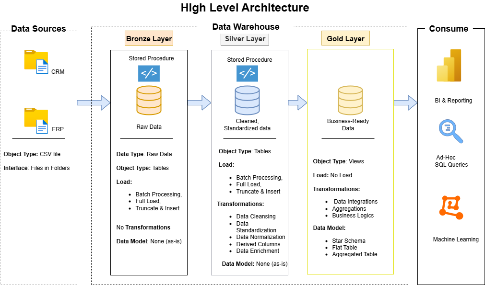

# 🏠 SQL Real Estate Data Warehouse Project  
  
This project showcases the complete design and implementation of a **modern data warehouse** for real estate analytics — from raw data ingestion to analytical modeling and reporting. 

---

## 🏗️ Data Architecture  

The data architecture follows the **Medallion (Bronze–Silver–Gold) Architecture**, widely used in modern data engineering workflows: 

| Layer | Description |
|--------|-------------|
| **Bronze Layer** | Stores raw property, sales, client, and agent data ingested from CSV files into MySQL. Data is captured *as-is* from the source systems. |
| **Silver Layer** | Performs data cleansing, standardization, and relationship enforcement through primary and foreign key constraints. This layer ensures data consistency and integrity. |
| **Gold Layer** | Delivers analytical, business-ready views in a **dimensional model (fact and dimension)** format — optimized for insights and reporting. |

---

## 📖 Project Overview  

This project demonstrates the end-to-end process of building a **real estate analytics warehouse**, focusing on structured SQL data pipelines and dimensional modeling.  

**Key Components Include:**  
- **Data Architecture:** Implementing a layered Medallion Architecture in MySQL.  
- **ETL Processing:** Extracting, transforming, and loading real estate datasets into the warehouse.  
- **Data Modeling:** Designing fact and dimension tables to support business analytics.  
- **SQL Analytics & Reporting:** Creating analytical views for sales trends, property distribution, and agent performance.  

---

## 🎯 Project Objectives  

- Build a scalable **SQL-based data warehouse** using the Medallion architecture.  
- Integrate and clean datasets related to properties, agents, clients, sales, and locations.  
- Develop **analytical SQL views** for fact and dimension models.  
- Support decision-making with **data-driven insights** into property and sales performance.  

---

## 🧠 Key Skills Demonstrated  

- **SQL Development** — Complex joins, constraints, and view creation.  
- **Data Modeling** — Implementation of dimensional models (facts & dimensions).  
- **Data Engineering** — Structured ETL workflows and schema design.  
- **Data Governance** — Enforcing referential integrity and standardized naming.  
- **Analytics** — Transforming raw data into business-ready insights.  

---
## 📊 BI: Analytics & Reporting (Data Analysis)

**Objective**  
Develop SQL-based analytics and reporting views to uncover key insights from the Real Estate Data Warehouse, empowering data-driven decision-making and performance tracking.

**Focus Areas**  

- 🏘️ **Property Performance:** Analyze sales distribution, property types, and price trends across different cities and states.  
- 👥 **Client Behavior:** Identify buying patterns, client-agent relationships, and customer segments.  
- 💼 **Agent Productivity:** Evaluate agent performance through total sales value, deal volume, and client engagement metrics.  

**Outcome**  
These analytics deliver actionable insights to real estate stakeholders — from understanding regional property trends to optimizing agent strategies — supporting smarter, evidence-based business decisions.

---

## 🧰 Tech Stack  

- **Database:** MySQL  
- **Language:** SQL  
- **Tools:** MySQL Workbench / DBeaver  
- **Architecture:** Bronze → Silver → Gold  

---

